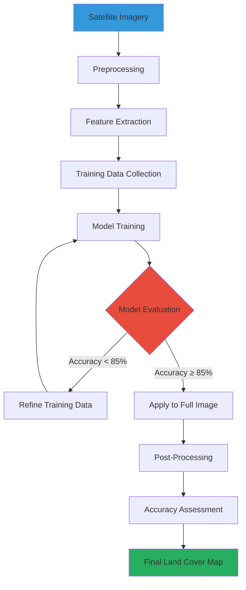

## Introduction to Land Cover Classification

Land cover classification is the process of categorizing every pixel in satellite imagery into meaningful classes like forest, water, urban, cropland, etc. This automated mapping enables large-scale environmental monitoring, urban planning, and resource management.

Modern machine learning algorithms can classify millions of pixels in minutes, achieving accuracies exceeding 90% when properly trained. This article explores the methodology, algorithms, and best practices for satellite image classification.

---

## Classification Workflow



---

## Classification Algorithms





**Random Forest Classifier**

Random Forest is an ensemble learning method that constructs multiple decision trees and outputs the mode of their predictions.

**Advantages:**
- Handles high-dimensional data well
- Resistant to overfitting
- Provides feature importance rankings
- Works with mixed data types
- No need for feature scaling

**Disadvantages:**
- Can be slow with very large datasets
- Less interpretable than single decision trees
- Memory intensive for many trees

**Python Implementation:**

```python
from sklearn.ensemble import RandomForestClassifier
from sklearn.model_selection import train_test_split
import numpy as np

# Prepare training data
# X: spectral bands + indices (n_samples, n_features)
# y: land cover labels (n_samples,)

X_train, X_test, y_train, y_test = train_test_split(
    X, y, test_size=0.3, random_state=42
)

# Train Random Forest
rf_classifier = RandomForestClassifier(
    n_estimators=100,      # Number of trees
    max_depth=20,          # Maximum tree depth
    min_samples_split=10,  # Minimum samples to split
    random_state=42,
    n_jobs=-1              # Use all CPU cores
)

rf_classifier.fit(X_train, y_train)

# Predict on test set
y_pred = rf_classifier.predict(X_test)

# Feature importance
feature_names = ['Blue', 'Green', 'Red', 'NIR', 'SWIR1', 'SWIR2', 'NDVI', 'NDWI']
importances = rf_classifier.feature_importances_
```

**Typical Accuracy:** 85-92% for 6-8 class problems





**Support Vector Machine (SVM)**

SVM finds the optimal hyperplane that separates different classes in feature space.

**Advantages:**
- Effective in high-dimensional spaces
- Memory efficient (uses subset of training points)
- Versatile through different kernel functions
- Works well with clear margin of separation

**Disadvantages:**
- Computationally expensive for large datasets
- Sensitive to parameter tuning
- Requires feature scaling
- Difficult to interpret

**Python Implementation:**

```python
from sklearn.svm import SVC
from sklearn.preprocessing import StandardScaler

# Scale features (required for SVM)
scaler = StandardScaler()
X_train_scaled = scaler.fit_transform(X_train)
X_test_scaled = scaler.transform(X_test)

# Train SVM with RBF kernel
svm_classifier = SVC(
    kernel='rbf',          # Radial basis function
    C=10,                  # Regularization parameter
    gamma='scale',         # Kernel coefficient
    random_state=42
)

svm_classifier.fit(X_train_scaled, y_train)
y_pred = svm_classifier.predict(X_test_scaled)
```

**Typical Accuracy:** 83-90% for 6-8 class problems





**Deep Neural Networks**

Multi-layer neural networks can learn complex non-linear patterns in satellite imagery.

**Advantages:**
- Can learn hierarchical features automatically
- Excellent for complex, non-linear relationships
- Scalable to very large datasets
- State-of-the-art performance with enough data

**Disadvantages:**
- Requires large training datasets
- Computationally intensive
- Many hyperparameters to tune
- "Black box" - difficult to interpret

**Python Implementation:**

```python
from tensorflow.keras.models import Sequential
from tensorflow.keras.layers import Dense, Dropout

# Build neural network
model = Sequential([
    Dense(128, activation='relu', input_shape=(n_features,)),
    Dropout(0.3),
    Dense(64, activation='relu'),
    Dropout(0.3),
    Dense(32, activation='relu'),
    Dense(n_classes, activation='softmax')
])

model.compile(
    optimizer='adam',
    loss='sparse_categorical_crossentropy',
    metrics=['accuracy']
)

# Train model
history = model.fit(
    X_train, y_train,
    validation_split=0.2,
    epochs=50,
    batch_size=32,
    verbose=1
)

# Predict
y_pred = model.predict(X_test).argmax(axis=1)
```

**Typical Accuracy:** 88-95% for 6-8 class problems (with sufficient data)





---

## Land Cover Classes

Common classification schemes include:

| Class ID | Class Name | Description | Typical Spectral Signature |
|:---------|:-----------|:------------|:---------------------------|
| 1 | Water | Lakes, rivers, reservoirs | Low NIR, high blue/green |
| 2 | Forest | Dense tree cover | Very high NIR, low red |
| 3 | Grassland | Natural grass, pasture | Moderate NIR, moderate red |
| 4 | Cropland | Agricultural fields | Variable (depends on crop stage) |
| 5 | Urban | Buildings, roads, pavement | High SWIR, moderate NIR |
| 6 | Barren | Bare soil, rock, sand | Increasing reflectance across spectrum |
| 7 | Wetland | Vegetated wetlands | High NIR, variable water signal |
| 8 | Snow/Ice | Permanent snow, glaciers | Very high visible, low SWIR |

---

## Feature Engineering

Effective classification requires carefully selected features:

### Spectral Bands
- Blue, Green, Red, NIR, SWIR1, SWIR2
- Raw reflectance values

### Spectral Indices
- **NDVI**: Vegetation vigor
- **NDWI**: Water content
- **NDBI**: Built-up areas
- **SAVI**: Sparse vegetation
- **NBR**: Burn severity

### Texture Features
- **GLCM** (Gray-Level Co-occurrence Matrix): Homogeneity, contrast, entropy
- **Variance**: Local variability
- **Edge detection**: Boundaries between classes

### Temporal Features
- **Mean**: Average value over time
- **Standard deviation**: Temporal variability
- **Percentiles**: 10th, 50th, 90th percentiles
- **Trend**: Linear slope over time

---

## Accuracy Assessment

### Confusion Matrix

A confusion matrix shows how well the classifier performs for each class:

| | **Predicted: Water** | **Predicted: Forest** | **Predicted: Urban** | **Predicted: Cropland** |
|:---|:---:|:---:|:---:|:---:|
| **Actual: Water** | 450 | 5 | 2 | 3 |
| **Actual: Forest** | 8 | 520 | 12 | 15 |
| **Actual: Urban** | 3 | 10 | 485 | 7 |
| **Actual: Cropland** | 12 | 18 | 8 | 462 |

### Accuracy Metrics

<table
  data-toggle="table"
  data-search="true"
  data-pagination="false">
  <thead>
    <tr>
      <th data-field="metric" data-sortable="true">Metric</th>
      <th data-field="formula" data-sortable="false">Formula</th>
      <th data-field="interpretation" data-sortable="false">Interpretation</th>
      <th data-field="example" data-sortable="true">Example Value</th>
    </tr>
  </thead>
  <tbody>
    <tr>
      <td><strong>Overall Accuracy</strong></td>
      <td>(TP + TN) / Total</td>
      <td>Percentage of correctly classified pixels</td>
      <td>89.2%</td>
    </tr>
    <tr>
      <td><strong>Producer's Accuracy</strong></td>
      <td>TP / (TP + FN)</td>
      <td>How well a class was classified (omission error)</td>
      <td>Water: 97.8%</td>
    </tr>
    <tr>
      <td><strong>User's Accuracy</strong></td>
      <td>TP / (TP + FP)</td>
      <td>Reliability of classified pixels (commission error)</td>
      <td>Water: 95.1%</td>
    </tr>
    <tr>
      <td><strong>F1-Score</strong></td>
      <td>2 × (Precision × Recall) / (Precision + Recall)</td>
      <td>Harmonic mean of precision and recall</td>
      <td>Water: 0.964</td>
    </tr>
    <tr>
      <td><strong>Kappa Coefficient</strong></td>
      <td>(Po - Pe) / (1 - Pe)</td>
      <td>Agreement beyond chance (0-1 scale)</td>
      <td>0.86</td>
    </tr>
  </tbody>
</table>

**Kappa Interpretation:**
- < 0.40: Poor agreement
- 0.40 - 0.60: Moderate agreement
- 0.60 - 0.80: Substantial agreement
- 0.80 - 1.00: Almost perfect agreement

---

## Classification Results Visualization

### Land Cover Distribution

```echarts
{
  "title": {
    "text": "Land Cover Distribution - Study Area",
    "left": "center",
    "textStyle": {
      "fontSize": 18
    }
  },
  "tooltip": {
    "trigger": "item",
    "formatter": "{b}: {c} km² ({d}%)"
  },
  "legend": {
    "orient": "vertical",
    "left": "left",
    "top": "middle"
  },
  "series": [
    {
      "name": "Land Cover",
      "type": "pie",
      "radius": ["40%", "70%"],
      "avoidLabelOverlap": true,
      "itemStyle": {
        "borderRadius": 10,
        "borderColor": "#fff",
        "borderWidth": 2
      },
      "label": {
        "show": true,
        "formatter": "{b}\n{d}%"
      },
      "emphasis": {
        "label": {
          "show": true,
          "fontSize": 16,
          "fontWeight": "bold"
        }
      },
      "data": [
        {
          "value": 1250,
          "name": "Forest",
          "itemStyle": {"color": "#27ae60"}
        },
        {
          "value": 850,
          "name": "Cropland",
          "itemStyle": {"color": "#f39c12"}
        },
        {
          "value": 420,
          "name": "Grassland",
          "itemStyle": {"color": "#d4ac0d"}
        },
        {
          "value": 380,
          "name": "Urban",
          "itemStyle": {"color": "#95a5a6"}
        },
        {
          "value": 280,
          "name": "Water",
          "itemStyle": {"color": "#3498db"}
        },
        {
          "value": 180,
          "name": "Barren",
          "itemStyle": {"color": "#d35400"}
        },
        {
          "value": 140,
          "name": "Wetland",
          "itemStyle": {"color": "#16a085"}
        }
      ]
    }
  ]
}
```

### Classification Accuracy by Class

```chartjs
{
  "type": "bar",
  "data": {
    "labels": ["Water", "Forest", "Grassland", "Cropland", "Urban", "Barren", "Wetland"],
    "datasets": [
      {
        "label": "Producer's Accuracy (%)",
        "data": [97.8, 93.7, 88.2, 92.6, 96.0, 85.4, 87.9],
        "backgroundColor": "rgba(52, 152, 219, 0.7)",
        "borderColor": "#3498db",
        "borderWidth": 2
      },
      {
        "label": "User's Accuracy (%)",
        "data": [95.1, 91.2, 86.5, 89.8, 94.3, 83.7, 85.2],
        "backgroundColor": "rgba(46, 204, 113, 0.7)",
        "borderColor": "#2ecc71",
        "borderWidth": 2
      }
    ]
  },
  "options": {
    "responsive": true,
    "plugins": {
      "title": {
        "display": true,
        "text": "Classification Accuracy by Land Cover Class",
        "font": {
          "size": 16
        }
      },
      "legend": {
        "position": "top"
      }
    },
    "scales": {
      "y": {
        "beginAtZero": true,
        "max": 100,
        "title": {
          "display": true,
          "text": "Accuracy (%)"
        }
      },
      "x": {
        "title": {
          "display": true,
          "text": "Land Cover Class"
        }
      }
    }
  }
}
```

---

## Change Detection Analysis

Comparing classifications from different years reveals land cover changes:

### Urban Expansion (2015-2023)

```geojson
{
  "type": "FeatureCollection",
  "features": [
    {
      "type": "Feature",
      "properties": {
        "name": "Urban Core (2015)",
        "description": "Original city boundaries",
        "year": 2015,
        "area_km2": 245
      },
      "geometry": {
        "type": "Polygon",
        "coordinates": [[
          [106.80, -6.20],
          [106.85, -6.20],
          [106.85, -6.25],
          [106.80, -6.25],
          [106.80, -6.20]
        ]]
      }
    },
    {
      "type": "Feature",
      "properties": {
        "name": "Urban Expansion (2015-2023)",
        "description": "New urban development areas",
        "year": 2023,
        "area_km2": 142
      },
      "geometry": {
        "type": "Polygon",
        "coordinates": [[
          [106.75, -6.18],
          [106.80, -6.18],
          [106.80, -6.20],
          [106.75, -6.20],
          [106.75, -6.18]
        ]]
      }
    },
    {
      "type": "Feature",
      "properties": {
        "name": "Deforested Area",
        "description": "Forest converted to agriculture",
        "year": 2023,
        "area_km2": 78
      },
      "geometry": {
        "type": "Polygon",
        "coordinates": [[
          [106.70, -6.15],
          [106.73, -6.15],
          [106.73, -6.17],
          [106.70, -6.17],
          [106.70, -6.15]
        ]]
      }
    }
  ]
}
```

**Key Findings:**
- Urban area increased by 58% (142 km²) from 2015-2023
- 78 km² of forest converted to agriculture
- Wetland area decreased by 23 km² due to drainage

---

## Best Practices

### 1. Training Data Quality

- **Minimum samples**: 50-100 pixels per class
- **Spatial distribution**: Cover entire study area
- **Spectral diversity**: Include variations within each class
- **Temporal consistency**: Match imagery acquisition dates
- **Validation**: Use independent test set (30% of data)

### 2. Feature Selection

```python
# Example: Feature importance analysis
import pandas as pd
import matplotlib.pyplot as plt

# Get feature importances from Random Forest
importances = rf_classifier.feature_importances_
indices = np.argsort(importances)[::-1]

# Create DataFrame
feature_df = pd.DataFrame({
    'Feature': [feature_names[i] for i in indices],
    'Importance': importances[indices]
})

# Keep top features (>5% importance)
important_features = feature_df[feature_df['Importance'] > 0.05]
```

### 3. Post-Processing

- **Majority filter**: Remove isolated pixels (salt-and-pepper noise)
- **Sieve filter**: Remove small patches below minimum mapping unit
- **Boundary smoothing**: Clean up jagged edges
- **Logical rules**: Apply constraints (e.g., water can't be above certain elevation)

### 4. Validation Strategy

- **Stratified sampling**: Ensure all classes represented
- **Cross-validation**: K-fold for robust accuracy estimates
- **Independent validation**: Use different imagery or field data
- **Error analysis**: Identify confused classes and refine

---

## Real-World Application: Agricultural Monitoring

**Objective**: Map crop types across 50,000 hectares

**Approach:**
1. Collect Sentinel-2 time series (12 images over growing season)
2. Calculate NDVI, NDWI, EVI for each date
3. Extract temporal statistics (mean, max, std, percentiles)
4. Collect 500 training samples (50 per crop type)
5. Train Random Forest classifier
6. Apply to full study area
7. Validate with farmer surveys

**Results:**
- Overall accuracy: 91.3%
- Kappa coefficient: 0.89
- Processing time: 45 minutes for 50,000 ha
- Cost savings: $15,000 vs. traditional field surveys

---

## Conclusion

Machine learning has transformed land cover classification from a manual, time-consuming process to an automated, scalable solution. Key takeaways:

- **Random Forest** is the most reliable general-purpose algorithm
- **Feature engineering** is as important as algorithm selection
- **Training data quality** directly impacts classification accuracy
- **Validation** must be rigorous and independent
- **Post-processing** significantly improves map quality

The combination of free satellite imagery (Sentinel-2, Landsat), open-source software (Python, QGIS), and powerful algorithms makes land cover classification accessible to anyone interested in monitoring our changing planet.

---

## Further Resources

- **Google Earth Engine**: Cloud-based platform for large-scale classification
- **QGIS Semi-Automatic Classification Plugin**: GUI-based classification tool
- **Scikit-learn Documentation**: Comprehensive ML algorithm reference
- **ESA SNAP**: Free software for Sentinel data processing

*Ready to start your own classification project? Have questions about specific algorithms or applications? Let me know!*
